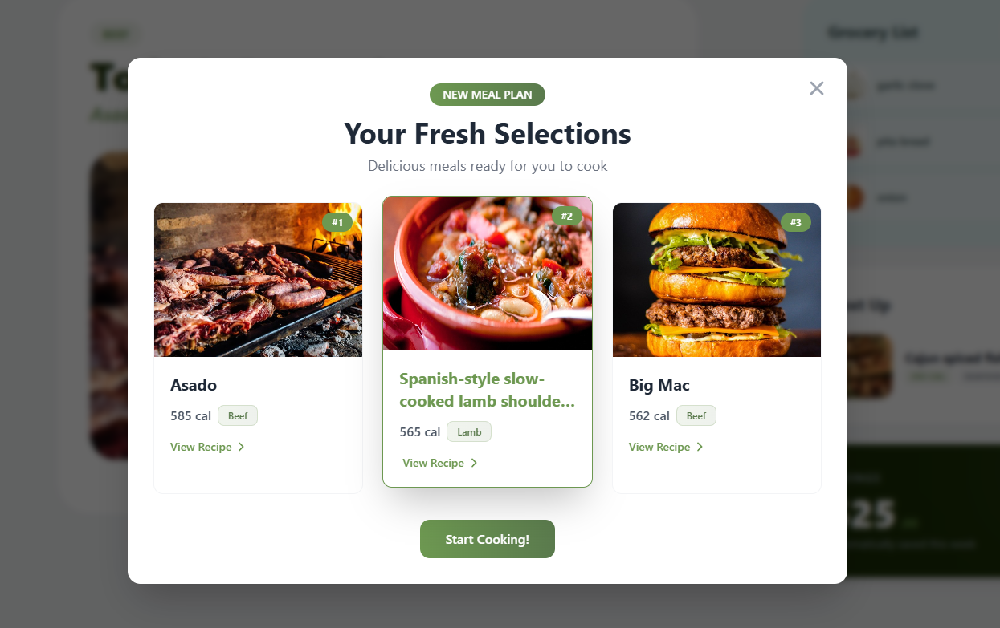
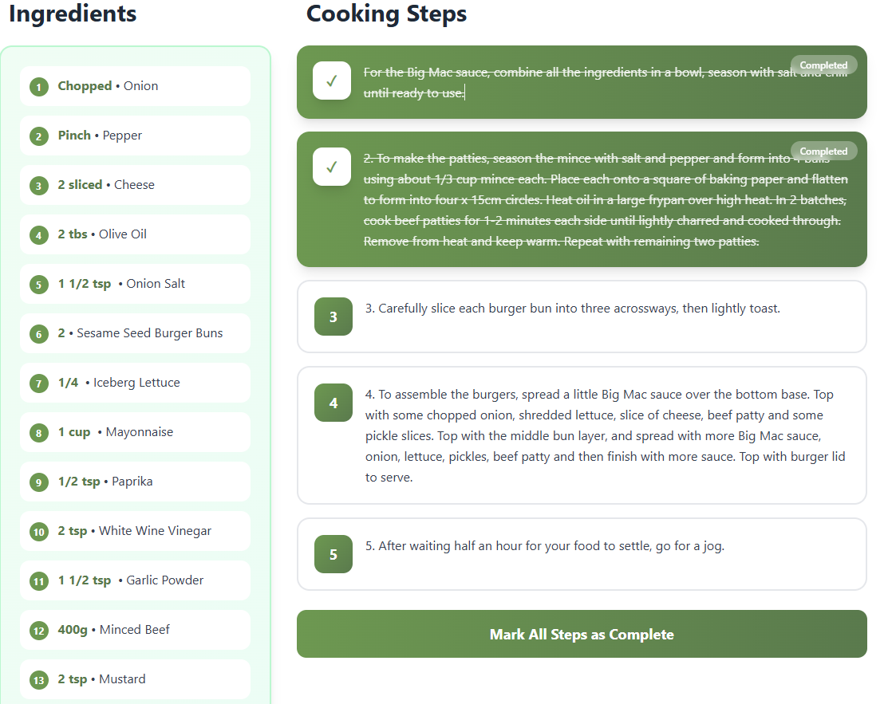
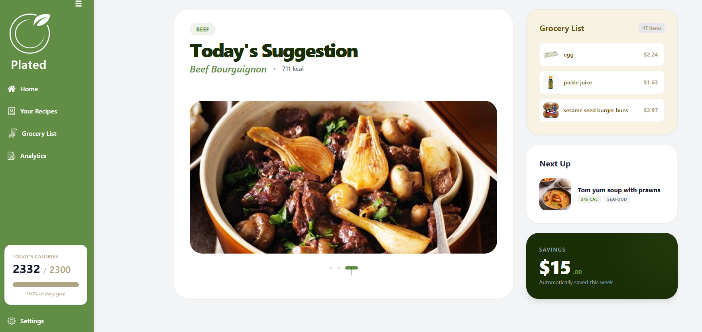

#  Plated
A full-stack application aimed to help you save food, tighten your budget, and plan interesting, tasteful meals from around the world! 🌎✨


---

## Demo Photos




##  Objective
This project, 'plated' aims to serve those who are on a budget or want help tracking what they eat — from calories to trying new foods — all in a way that’s easy to manage through the app, so you can spend more time doing what’s important to you!

---

## Getting started

Currently, pantry assist is only hosted with the frontend, if you'd like to run this code locally, you need:
- AWS RDS, EC2 instances
- Pg Admin
- API keys relevant (Walmart, with public/private keys, MealDB, Nutrionix which is now deprecated)

  ### 💻 To run it locally:
```bash
git clone https://github.com/bmar1/Pantry-Assist.git
npm install
npm start
```

## ⚙️ Features

###  Grocery Tracking / Planning
This application, based on your requirements and use cases, adapts to help you find interesting meals while providing grocery prices in your local area via Walmart’s data.

###  Meal Planning
Need help tracking how many calories you eat or what exactly you’re eating? Say no more! Pantry Assist easily tracks your weekly meals in a clean, organized format.

###  Secure Login
Pantry Assist boasts secure, role-based access control throughout the app, enforcing security through JWT tokens.

### Ease of use
We offer an easy UI to navigate through to help you day-by-day to cook, and plan your meals!



---

## 🚀 Setup / Use

### 🌐 No need to worry!
Feel free to refer to the website currently, hosted full-stack on AWS EC2!

**http://44.200.225.217/landing**

Frontend Only Host:
https://pantry-assist.vercel.app/landing

### Contributing

If you'd like to contribute, reach out to me on any social media and let's talk

Otherwise, feel free to leave some issues or pull requests!


