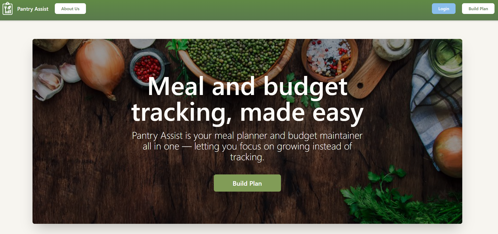

# 🥫 Pantry-Assist
A full-stack application aimed to help you save food, tighten your budget, and plan interesting, tasteful meals from around the world! 
---



## 🎯 Objective
This project aims to serve those who are on a budget or want help tracking what they eat — from calories to trying new foods — all in a way that’s easy to manage through the app, so you can spend more time doing what’s important to you!

---

## ⚙️ Features

### Grocery Tracking / Planning
This application, based on your requirements and use cases, adapts to help you find interesting meals while providing grocery prices in your local area via Walmart’s data.

### Meal Planning  
Need help tracking how many calories you eat or what exactly you’re eating? Say no more! Pantry Assist easily tracks your weekly meals in a clean, organized format.

### Curated meal plans
As soon as you finish today's or tomorrows meal plan, a new one is generated for you, ready to eat, instructions provided!

### Secure Login  
Pantry Assist boasts secure, role-based access control throughout the app, enforcing security through JWT tokens.

---

## 🚀 Setup / Use

### No need to worry!  
Feel free to refer to the website and use Pantry Assist (currently frontend only, pending AWS deployment) directly from there.

### 💻 If you'd like to run it locally:
```bash
git clone https://github.com/bmar1/Pantry-Assist.git
npm install
npm start
```

####
This project is maintained by me only. For contributions, please contact me, and we could discuss.
